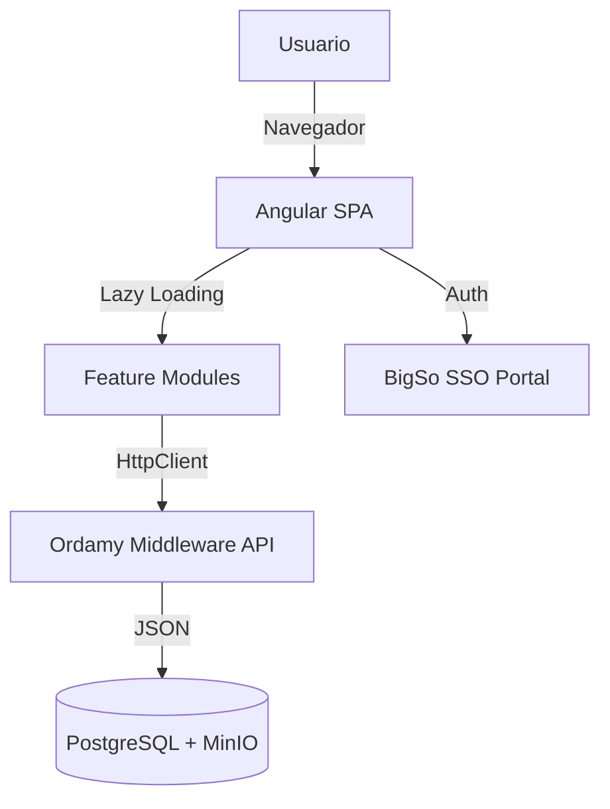
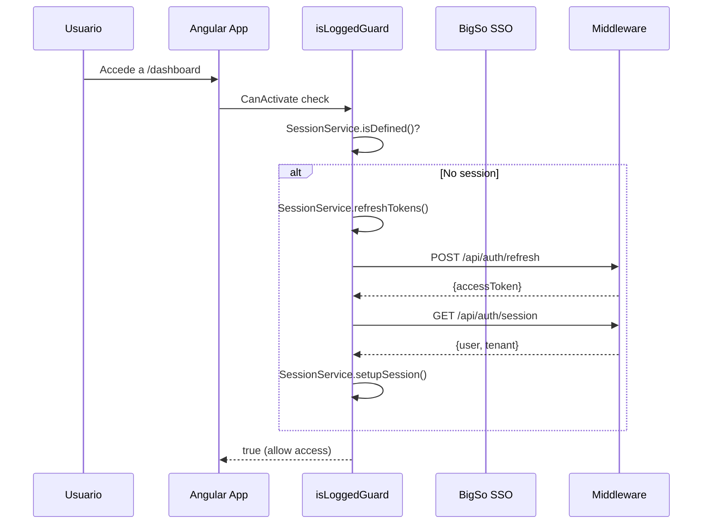
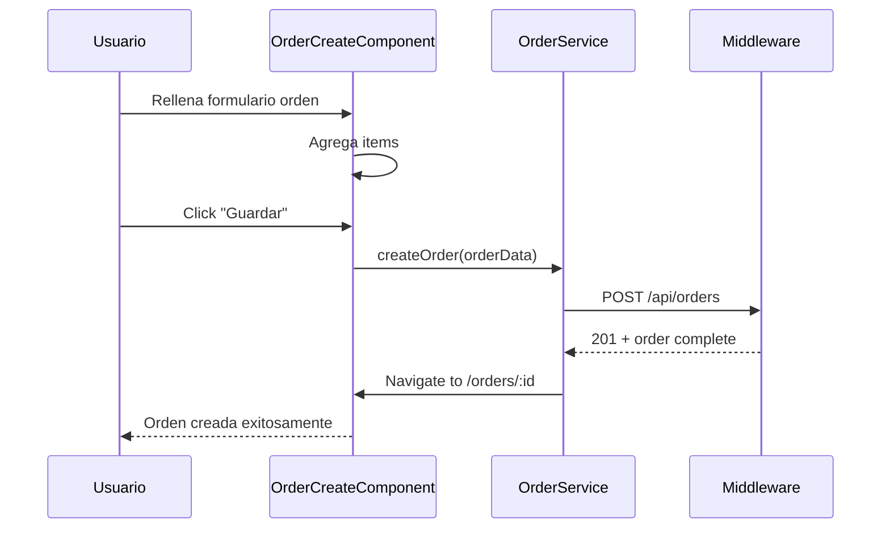
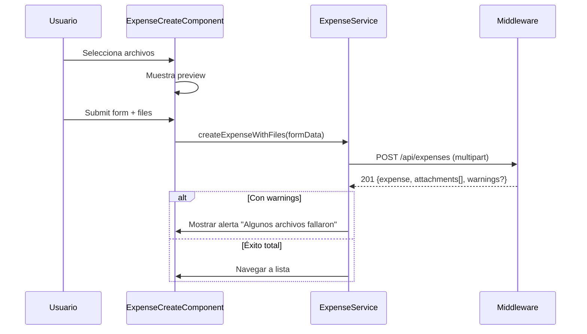

# Architecture — Ordamy Frontend

## Visión General

El Ordamy Frontend es una Single Page Application (SPA) construida con Angular 21 que implementa una arquitectura modular con lazy loading. La aplicación proporciona una interfaz de usuario completa para la gestión de órdenes, clientes, egresos y reportes, comunicándose con el Ordamy Middleware mediante una API RESTful.

La arquitectura sigue el patrón de diseño de Angular con separación clara entre la capa de presentación (componentes), lógica de negocio (servicios) y acceso a datos (HTTP Client).



## Componentes Principales

### App Module y Routing

- **Responsabilidad:** Bootstrap de la aplicación, configuración global
- **Entry Point:** `main.ts` → `AppComponent`
- **Configuración:** `app.config.ts` provee providers globales

### Core Module (Core)

Contiene funcionalidad singleton que se carga una vez:

**Guards:**
- `isLoggedGuard`: Verifica sesión SSO activa mediante `SessionService`
- `hasPermissionGuard`: Verifica permisos RBAC por recurso
- `ValidTenantGuard`: Valida que el tenant exista en URLs públicas

**Interceptors:**
- `AuthInterceptor`: Agrega headers de autenticación a requests
- `ErrorInterceptor`: Manejo global de errores HTTP

**Servicios Core:**
- `SessionService`: Gestión de sesión, tokens, refresh automático
- `AppConfigService`: Configuración de la aplicación
- `LoadingService`: Estado de carga global
- `ToastService`: Notificaciones toast

### Feature Modules (Lazy Loaded)

Cada módulo de funcionalidad se carga bajo demanda para optimizar el bundle inicial:

| Módulo | Ruta | Descripción |
|--------|------|-------------|
| `auth` | `/auth/*` | Login, logout, callback SSO |
| `dashboard` | `/dashboard` | Dashboard principal con métricas |
| `orders` | `/orders/*` | CRUD órdenes, flujo de producción |
| `customers` | `/customers/*` | Gestión de clientes |
| `expenses` | `/expenses/*` | Gestión de egresos con adjuntos |
| `cashier` | `/cashier` | Registro de pagos, caja diaria |
| `portfolio` | `/portfolio` | Cartera (órdenes con saldo pendiente) |
| `reports` | `/reports/*` | Reportes financieros |
| `products` | `/products/*` | Catálogo de productos |
| `materials` | `/materials/*` | Inventario de materiales |
| `settings` | `/settings/*` | Configuración del tenant |
| `public` | `/org/*`, `/portal-usuarios/*` | Portal público de clientes |

### Services Layer

Los servicios en `core/services/` encapsulan la lógica de negocio y comunicación HTTP:

- `SessionService`: Autenticación y gestión de sesión
- `CustomerService`: API de clientes
- `OrderService`: API de órdenes
- `ExpenseService`: API de egresos y adjuntos
- `PaymentService`: API de pagos
- `AccountService`: API de cuentas financieras
- `ReportService`: API de reportes
- `ProductService`: API de productos
- `MaterialService`: API de materiales
- `SettingsService`: API de configuración
- `TenantService`: API de tenants
- `SdkService`: Wrapper de SDK interno

## Flujos Críticos

### Autenticación SSO



### Creación de Orden



### Subida de Adjuntos (Egreso)



## Decisiones Técnicas

| Decisión | Alternativas Evaluadas | Razón |
|----------|------------------------|-------|
| **Angular vs React** | React, Vue | Ecosistema maduro, arquitectura clara, equipo familiarizado |
| **Tailwind CSS vs Bootstrap** | Bootstrap, Material | Utility-first más mantenible, CSS variables para theming |
| **Standalone Components vs NgModules** | NgModules tradicional | Angular 14+ moderno, lazy loading más simple |
| **Servicios vs NgRx** | NgRx, NGXS | Simplicidad, RxJS suficiente para estado local |

## Dependencias Clave

| Paquete | Versión | Propósito |
|---------|---------|-----------|
| `@angular/core` | ^21.2.9 | Framework base |
| `@angular/common/http` | ^21.2.9 | Cliente HTTP |
| `@angular/router` | ^21.2.9 | Navegación SPA |
| `@angular/cdk` | ^20.2.14 | Component Development Kit |
| `rxjs` | ~7.8.0 | Programación reactiva |
| `tslib` | ^2.3.0 | Runtime helpers |
| `zone.js` | ~0.15.1 | Change detection |
| `tailwindcss` | ^3.4.19 | Framework CSS |
| `prettier` | ^3.5.3 | Formateo de código |
| `prettier-plugin-tailwindcss` | ^0.6.11 | Formateo Tailwind |

## Arquitectura de Routing

```mermaid
graph TD
    A[/] --> B[HomeModule]
    A --> C[AuthModule - /auth]
    A --> D[PublicModule - /org/*]
    A --> E[LoggedLayoutModule]
    
    E --> F[Dashboard - /dashboard]
    E --> G[OrdersModule - /orders/*]
    E --> H[CustomersModule - /customers/*]
    E --> I[ExpensesModule - /expenses/*]
    E --> J[CashierModule - /cashier]
    E --> K[PortfolioModule - /portfolio]
    E --> L[ReportsModule - /reports/*]
    E --> M[ProductsModule - /products/*]
    E --> N[MaterialsModule - /materials/*]
    E --> O[SettingsModule - /settings/*]
    E --> P[SupportModule - /support]
```

## Guards y Seguridad

### Guard: `isLoggedGuard`

Verifica autenticación antes de cargar módulos protegidos:

```typescript
export const isLoggedGuard: CanActivateFn = (route, state) => {
  const sessionService = inject(SessionService);
  const router = inject(Router);
  
  if (sessionService.isDefined()) {
    return true;
  }
  
  return sessionService.refreshTokens().pipe(
    switchMap(() => sessionService.getSession()),
    map(session => {
      if (session?.user) {
        sessionService.setupSession(session);
        return true;
      }
      router.navigate(['/']);
      return false;
    }),
    catchError(() => {
      router.navigate(['/']);
      return of(false);
    })
  );
};
```

### Guard: `hasPermissionGuard`

Verifica permisos RBAC granulares:

```typescript
export const hasPermissionGuard = (resource: string, action: string) => {
  return () => {
    const sessionService = inject(SessionService);
    const permissions = sessionService.permissions();
    return permissions.includes(`${resource}:${action}`);
  };
};
```

## Estilos y Theming

### Tailwind Configuration

```javascript
// tailwind.config.js
module.exports = {
  content: ["./src/**/*.{html,ts}"],
  theme: {
    extend: {
      colors: {
        // Usa CSS variables para theming dinámico
        border: 'hsl(var(--border))',
        background: 'hsl(var(--background))',
        foreground: 'hsl(var(--foreground))',
        primary: {
          DEFAULT: 'hsl(var(--primary))',
          foreground: 'hsl(var(--primary-foreground))',
        },
        destructive: {
          DEFAULT: 'hsl(var(--destructive))',
          foreground: 'hsl(var(--destructive-foreground))',
        },
        muted: {
          DEFAULT: 'hsl(var(--muted))',
          foreground: 'hsl(var(--muted-foreground))',
        },
        card: {
          DEFAULT: 'hsl(var(--card))',
          foreground: 'hsl(var(--card-foreground))',
        },
      },
      fontFamily: {
        inter: ['Inter', 'system-ui', 'sans-serif'],
      },
    },
  },
}
```

### Variables CSS Globales

Definidas en `styles.scss`:

```scss
:root {
  --background: 0 0% 100%;
  --foreground: 222.2 84% 4.9%;
  --primary: 222.2 47.4% 11.2%;
  --primary-foreground: 210 40% 98%;
  // ... más variables
}
```

## Performance

### Lazy Loading

Todos los módulos de feature se cargan bajo demanda:

```typescript
// app.routes.ts
{
  path: 'orders',
  loadComponent: () =>
    import('./modules/orders/orders.component')
      .then(m => m.OrdersComponent)
}
```

### Optimizaciones de Build

```json
// angular.json
{
  "optimization": {
    "scripts": true,
    "styles": true,
    "fonts": true
  },
  "aot": true,
  "buildOptimizer": true,
  "vendorChunk": true
}
```

## Accesibilidad

- **ARIA labels:** En componentes interactivos
- **Keyboard navigation:** Soporte completo de teclado
- **Focus management:** Estados de foco visibles
- **Screen readers:** Compatible con lectores de pantalla
- **Color contrast:** Ratio mínimo 4.5:1

## Configuración por Ambiente

```typescript
// environments/environment.ts (desarrollo)
export const environment = {
  production: false,
  apiUrl: 'http://localhost:4300/api',
  ssoUrl: 'https://sso.bigso.co',
  appId: 'ordamy'
};

// environments/environment.prod.ts (producción)
export const environment = {
  production: true,
  apiUrl: 'https://api.ordamy.bigso.co/api',
  ssoUrl: 'https://sso.bigso.co',
  appId: 'ordamy'
};
```
