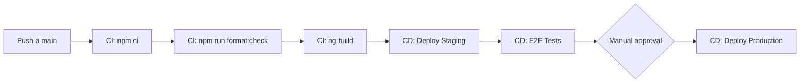

# Operations — Ordamy Frontend

## Deploy

### Pipeline CI/CD



### Build de Producción

```sh
# Build optimizado
npm run build

# El output se genera en:
# dist/ordamy-frontend/browser/

# Contenido:
# - index.html
# - main.*.js
# - polyfills.*.js
# - styles.*.css
# - assets/
# - manifest.json
# - sw.js (Service Worker)
```

### Deploy a Servidor Estático

El frontend es una SPA estática que puede servirse desde cualquier servidor web:

```sh
# Ejemplo con nginx
server {
    listen 80;
    server_name ordamy.bigso.co;
    root /var/www/ordamy-frontend;
    index index.html;

    # SPA routing - todas las rutas a index.html
    location / {
        try_files $uri $uri/ /index.html;
    }

    # Cache de assets estáticos
    location ~* \.(js|css|png|jpg|jpeg|gif|ico|svg|woff|woff2|ttf|eot)$ {
        expires 1y;
        add_header Cache-Control "public, immutable";
    }

    # Gzip
    gzip on;
    gzip_types text/plain text/css application/json application/javascript text/xml application/xml;
}
```

### Deploy con Docker

```dockerfile
# Dockerfile
FROM node:20-alpine AS builder
WORKDIR /app
COPY package*.json ./
RUN npm ci
COPY . .
RUN npm run build

FROM nginx:alpine
COPY --from=builder /app/dist/ordamy-frontend/browser /usr/share/nginx/html
COPY nginx.conf /etc/nginx/conf.d/default.conf
EXPOSE 80
```

## Variables de Entorno

### Por Ambiente

| Variable | Desarrollo | Staging | Producción |
|----------|------------|---------|------------|
| `apiUrl` | `http://localhost:4300/api` | `https://api-staging.ordamy.bigso.co/api` | `https://api.ordamy.bigso.co/api` |
| `ssoUrl` | `https://sso.bigso.co` | `https://sso.bigso.co` | `https://sso.bigso.co` |
| `appId` | `ordamy` | `ordamy` | `ordamy` |

### Configuración en Angular

Los environments se definen en `src/environments/`:

```typescript
// environments/environment.ts (desarrollo)
export const environment = {
  production: false,
  apiUrl: 'http://localhost:4300/api',
  ssoUrl: 'https://sso.bigso.co',
  appId: 'ordamy'
};

// environments/environment.prod.ts (producción)
export const environment = {
  production: true,
  apiUrl: 'https://api.ordamy.bigso.co/api',
  ssoUrl: 'https://sso.bigso.co',
  appId: 'ordamy'
};
```

## Monitoreo

### Métricas de Frontend

| Métrica | Umbral Alerta |
|---------|---------------|
| Bundle size | > 500KB (main) |
| First Contentful Paint | > 1.8s |
| Time to Interactive | > 3.5s |
| Lighthouse Score | < 90 |

### Health Check

```sh
# Verificar build exitoso
curl -s https://ordamy.bigso.co | head -1

# Esperado: <!doctype html> o similar

# Verificar service worker
curl -s https://ordamy.bigso.co/sw.js | head -1

# Esperado: JavaScript del SW
```

### Source Maps

Los source maps se generan en producción para debugging:

```json
// angular.json
{
  "configurations": {
    "production": {
      "sourceMap": true,
      "optimization": true,
      "outputHashing": "all"
    }
  }
}
```

## Rollback

### Rollback de Versión

```sh
# Identificar versión anterior
git tag -l | sort -V | tail -5

# Checkout versión estable
git checkout v1.2.3

# Rebuild
npm ci
npm run build

# Deploy versión anterior
rsync -avz dist/ordamy-frontend/browser/ server:/var/www/ordamy/
```

### Feature Flags (si implementadas)

```typescript
// environment.ts
export const environment = {
  features: {
    newDashboard: false,  // Deshabilitar en rollback
    betaReports: false
  }
};
```

## Incidentes Comunes

| Incidente | Síntoma | Solución |
|-----------|---------|----------|
| **Blank page** | Pantalla blanca después de deploy | Verificar que todos los chunks JS se sirvan, revisar consola de errores |
| **404 en rutas** | Refresco en /orders/123 da 404 | Configurar nginx/apache para SPA routing (fallback a index.html) |
| **CSS roto** | Estilos no aplican | Verificar que Tailwind se compiló, revisar styles.css en network tab |
| **SW no actualiza** | Cambios no reflejan | Forzar unregister SW en DevTools > Application > Service Workers |
| **CORS error** | Calls a API fallan | Verificar que apiUrl apunta a backend correcto con CORS habilitado |
| **Memory leak** | App se pone lenta con uso | Revisar suscripciones no destruidas, usar takeUntil o async pipe |

## Performance

### Optimizaciones de Build

```json
// angular.json optimizations
{
  "optimization": {
    "scripts": true,
    "styles": true,
    "fonts": true
  },
  "aot": true,
  "buildOptimizer": true,
  "vendorChunk": true,
  "extractLicenses": true
}
```

### Lazy Loading Verification

```sh
# Verificar que lazy loading funciona
# En DevTools > Network, navegar entre rutas

# Deberías ver:
# - Carga inicial: main.js, vendor.js
# - Al navegar a /orders: orders-xxx.js (chunk separado)
```

### Preconnect

Configurado en `index.html`:

```html
<head>
  <link rel="preconnect" href="https://api.ordamy.bigso.co">
  <link rel="preconnect" href="https://sso.bigso.co">
</head>
```

## PWA Updates

### Estrategia de Actualización

```typescript
// app.component.ts
import { SwUpdate } from '@angular/service-worker';

export class AppComponent {
  constructor(private swUpdate: SwUpdate) {
    if (this.swUpdate.isEnabled) {
      this.swUpdate.versionUpdates.subscribe(event => {
        if (event.type === 'VERSION_READY') {
          // Notificar usuario de actualización disponible
          if (confirm('Nueva versión disponible. ¿Recargar?')) {
            window.location.reload();
          }
        }
      });
    }
  }
}
```

### Forzar Update Manual

```javascript
// En consola del navegador
// 1. Unregister SW
navigator.serviceWorker.getRegistrations().then(regs => {
  regs.forEach(r => r.unregister());
});

// 2. Clear cache
 caches.keys().then(names => {
   names.forEach(name => caches.delete(name));
 });

// 3. Recargar
location.reload(true);
```

## Análisis de Bundle

```sh
# Analizar tamaño del bundle
npm run build -- --stats-json
npx webpack-bundle-analyzer dist/ordamy-frontend/stats.json

# Identificar:
# - Módulos grandes que pueden lazy-load
# - Dependencias duplicadas
# - Código muerto
```
